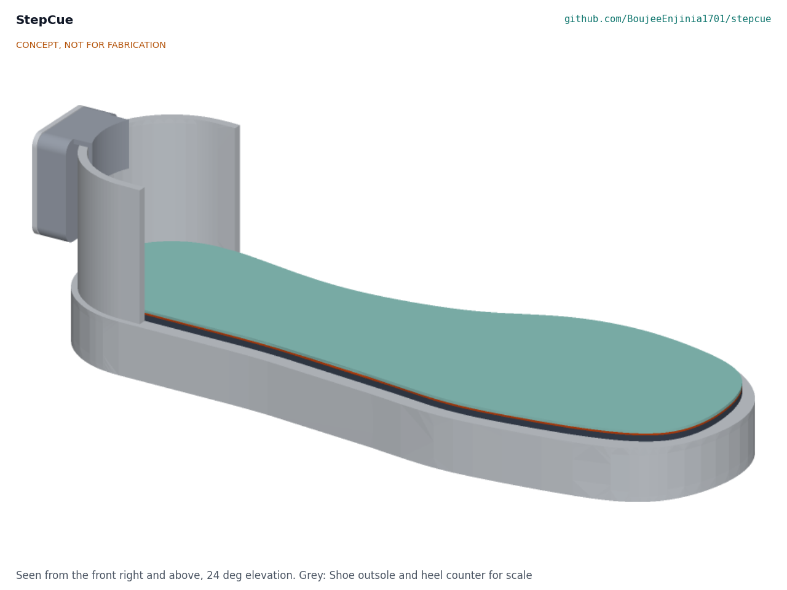

# StepCue

  

**Area:** BioMedical · **TRL:** 3 of 9 (proof of concept on paper) · **Prototype budget:** about $200 USD · **Difficulty:** 3 of 5

Pressure-sensing insole that detects the onset of a freeze and triggers a rhythmic haptic or audio cue.

[Interactive 3D model](media/viewer.html) · [Concept blueprint (PDF)](media/concept-blueprint.pdf) · [General arrangement (PDF)](cad/drawings/STC-DWG-001.pdf) · [Sizing calculations](docs/04-calcs/01-sizing.md) · [Review note](docs/REVIEW.md)

## Concept rationale

Research systems that detect a freeze and cue only when it starts have mostly used accelerometers strapped to the shank, thigh or trunk, with the cue played through headphones. StepCue moves the sensing into the one place the wearer already puts on every day, the shoe: a thin insole reads how the foot is loading, a pod clipped to the heel counter holds the electronics and cell outside the shoe, and the default cue is a vibration under the arch, felt only by the wearer. Plantar pressure has predicted freezes in published work, and a foot-level design avoids straps and body-worn modules that people with reduced dexterity find hard to fit.

The design is open and garage-buildable so that the detector, the cue timing and the data format can be inspected and changed by clinics, researchers and patient groups rather than hidden in a closed product. It uses commercial force-sensing resistors, copper-tape traces on film, a common Bluetooth microcontroller module and 3D-printed parts, about $83 in parts for one instrumented insole and pod, against commercial cueing devices listed at £795 to £834. It is a research and educational prototype, not a medical device.

## Burning platform

The World Health Organization estimates that [more than 8.5 million people had Parkinson's disease in 2019 and that prevalence has doubled in the past 25 years](https://www.who.int/news-room/fact-sheets/detail/parkinson-disease). A meta-analysis of 29 studies put freezing of gait at [39.9 % of people with Parkinson's, rising to about 71 % after ten years with the disease](https://link.springer.com/article/10.1186/s41016-020-00197-y), and a Cochrane review notes that [most people with Parkinson's fall at least once during the course of the disease](https://www.cochrane.org/evidence/CD011574_interventions-preventing-falls-parkinsons-disease).

Cueing helps many people get moving again, but the devices that deliver it are costly and closed. The Path Finder shoe attachment is listed at [£834](https://techguide.parkinsons.org.uk/catalogue/path-finder) and the CUE1+ vibrotactile device at [£795 plus VAT](https://techguide.parkinsons.org.uk/catalogue/cue1plus), and the WHO notes that even the core medicine, levodopa, is [not accessible, available or affordable everywhere, particularly in low- and middle-income countries](https://www.who.int/news-room/fact-sheets/detail/parkinson-disease).

## Where it could be used

### By industry

| Industry | Use |
| --- | --- |
| Movement disorders research | Open reference platform for freeze detection and on-demand cueing studies, with a documented data format |
| Physiotherapy and rehabilitation | Adjustable cue tempo and a cue log to support home gait programs |
| Assistive technology and footwear | Reference design for sensing insoles that fit ordinary shoes |
| Biomedical engineering education | Teaching project in sensing, signal processing and embedded firmware with a clear safety envelope |
| Patient organizations and makerspaces | Low-cost builds for evaluation and co-design with people who freeze |

### By country or region

| Country or region | Why it matters there |
| --- | --- |
| China | About [5.1 million people with Parkinson's in 2021](https://www.sciencedirect.com/science/article/pii/S2666606524000725) (Xu et al., 2024), so low-cost cueing could reach many people |
| United Kingdom | Commercial cueing devices are listed at [£795 to £834](https://techguide.parkinsons.org.uk/catalogue/path-finder); an open design gives clinics and charities a cheaper research option |
| United States | About 930,000 people aged 45 and over with Parkinson's in 2020, projected to reach about 1.24 million by 2030 ([Marras et al., *npj Parkinson's Disease*, 2018](https://www.nature.com/articles/s41531-018-0058-0)); research groups could share one open detection platform and data format |
| India | The share of people aged 60 and over is projected to double to more than 20 % by 2050, and over 40 % of older people are in the poorest wealth quintile ([UNFPA India, 2023](https://india.unfpa.org/en/news/india-ageing-elderly-make-20-population-2050-unfpa-report)), so costly imported devices are out of reach for many |
| Sub-Saharan Africa | The WHO notes limited access to Parkinson's medicine in [low- and middle-income countries](https://www.who.int/news-room/fact-sheets/detail/parkinson-disease); a locally buildable cue aid needs no specialist supply chain |
| Brazil | About 535,000 people aged 50 and over were estimated to live with Parkinson's disease in 2024, projected to reach about 1.25 million by 2060 ([Schlickmann et al., *Lancet Regional Health: Americas*, 2025](https://www.sciencedirect.com/science/article/pii/S2667193X25000560)); locally built research devices can support rehabilitation studies |

## What sparked the idea

The starting point was the [wearable assistant built by ETH Zurich and the Tel Aviv Sourasky Medical Center in the EU Daphnet project](https://pubmed.ncbi.nlm.nih.gov/19906597/) (Bächlin et al., IEEE Transactions on Information Technology in Biomedicine, 2010). It used acceleration sensors on the legs and hip to detect freezes in ten people with Parkinson's and played a rhythmic sound to help them walk again, detecting 73.1 % of freezes at 81.6 % specificity, and most participants found the automatic cue helpful. That study proved that on-demand cueing works, and its recordings became a public benchmark, but its sensors were worn on the body and its cue was delivered through headphones. StepCue asks whether the same closed loop can live in the shoe: pressure under the foot plus a small heel pod, and a vibration the wearer feels rather than hears.

## Problem

Freezing of gait in Parkinson's causes falls, and cueing devices are expensive.

## Concept

A thin insole with five force-sensing resistors and a coin vibration motor connects by a flat flex tail to a small pod clipped over the heel of the shoe. The pod samples the pressure sensors and its own motion sensor 104 times a second, checks every 0.25 s for the pattern of a freeze, and pulses the motor at the wearer's own cadence until walking resumes; audio, where preferred, plays through a paired phone or earbuds. The TRL 3 calculations (STC-CAL-001) give $83.44 in parts for one instrumented insole and heel pod, a 4.5 mm insole stack and 12.5 days per charge (7.4 conservative). Detection speed, reliability and nuisance cues are at risk and cannot be shown without labeled data.

Full design precis: [docs/02-concept.md](docs/02-concept.md)

## Key components

- Force-sensing resistors (5)
- Laminated sensor film with a flat flex tail
- nRF52840 controller module with built-in 6-axis IMU in a clip-on heel pod
- Coin vibration motor under the arch
- 400 mAh protected LiPo cell (in the pod, outside the shoe)

The working bill of materials is in [bom/bom.csv](bom/bom.csv).

## Safety

> This is a research and educational prototype. It is not a medical device, has not been cleared or approved by any regulator, and must not be used to diagnose, treat or monitor any person, or relied on to prevent falls. The heel pod holds a lithium cell: use a protected cell and never charge it while worn.

## Repository layout

| Folder | Contents |
| --- | --- |
| `docs/` | Problem, concept, requirements, calculations and design decisions |
| `cad/src/` | build123d Python source, the source of truth for all geometry |
| `cad/step/`, `cad/stl/` | Exported models for FreeCAD, other CAD tools and printing |
| `cad/drawings/` | 2D sketches and dimensioned drawings |
| `bom/` | Bill of materials |
| `electronics/` | KiCad schematics and PCB layouts |
| `firmware/` | Microcontroller code |
| `media/` | Renders, perspectives and photos |
| `build-log/` | Dated prototyping notes |

## Documentation

Controlled documents follow the portfolio [documentation standard](.kit/STANDARDS.md). Each carries a document ID (STC-PRC-001 for the precis), a version and a revision history. Branded PDFs are built with `python .kit/render.py` and attached to GitHub Releases when a document is tagged, for example `STC-PRC-001/v1.0`.

## Credits

Designed by Amish Chadha. See [CONTRIBUTORS.md](CONTRIBUTORS.md) for roles. To cite this design, use [CITATION.cff](CITATION.cff) (GitHub shows it as "Cite this repository").

AI assistance (Claude) was used to accelerate concept renders, prototype documentation and first-pass sizing calculations. Design direction and all decisions are Amish Chadha's, recorded in this repository's decision records (`docs/decisions/`).

## Licenses

- **Hardware** (CAD, drawings, BOM, electronics): [CERN-OHL-S v2](LICENSE)
- **Software** (firmware, scripts, notebooks): [MIT](LICENSE-SOFTWARE)

A project of the [Design Molecule](https://designmolecule.com) lab.
