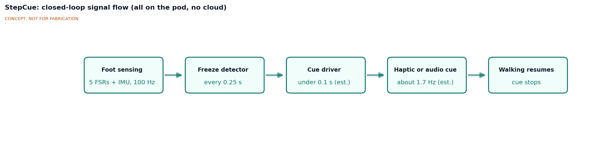
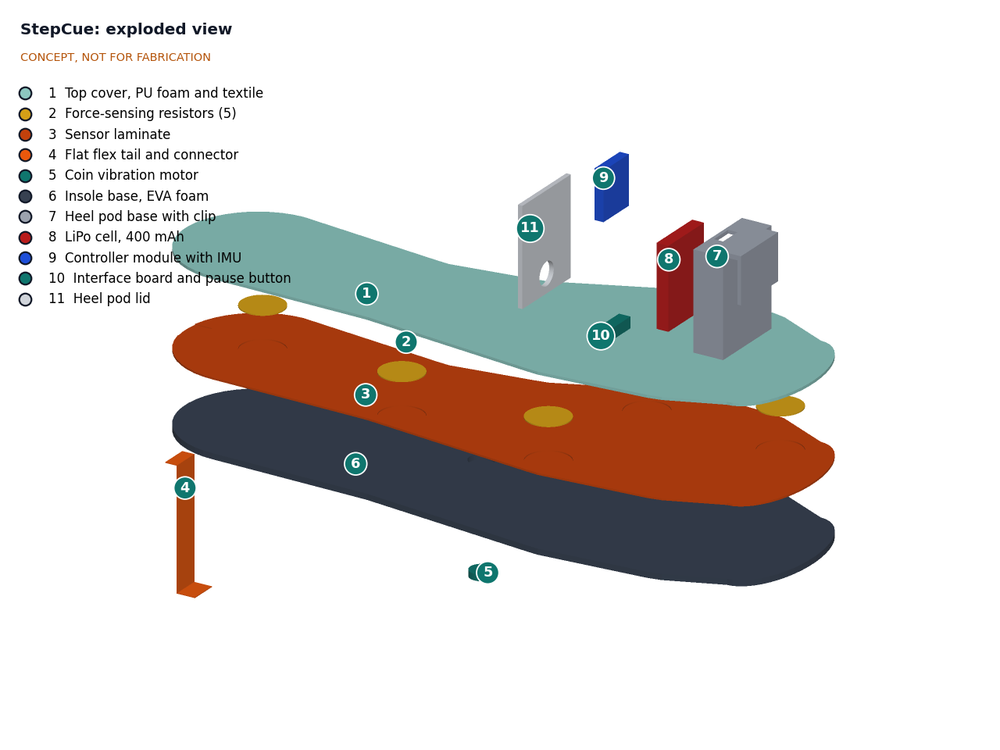
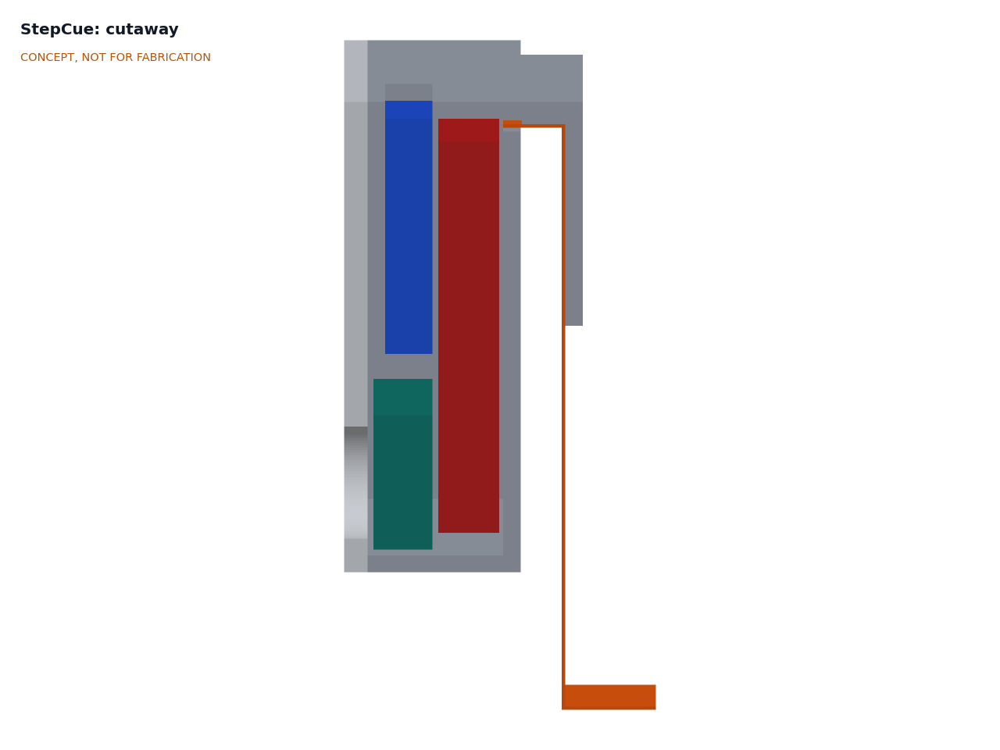

# StepCue design precis

StepCue is a thin insole with five force-sensing resistors and a coin vibration motor, wired by a flat flex tail to a small pod that clips over the heel of the shoe. The pod reads the pressure sensors and its own motion sensor 104 times a second, decides every 0.25 s whether a freeze is starting, and if so pulses the motor at the wearer's own walking rhythm until steps resume. The calculation note STC-CAL-001 puts one unit at $83.44 in parts and 12.5 days per charge (7.4 days conservative). The insole stack is 4.50 mm against a 5.0 mm limit. Whether the detector is fast and reliable enough (R3 to R5) cannot be shown on paper and is the main risk; the calculations show those three requirements pull against one another.

*Figure 1. Hero render from the TRL 3 parametric model. The grey shoe outsole and heel counter are shown for scale only.*

## How it works

1. **Sense.** Five force-sensing resistors (FSRs) laminated into the insole measure load under the heel, the lateral midfoot, the first and fifth metatarsal heads and the hallux. The 6-axis IMU on the controller module in the heel pod measures the motion of the shoe. All six signals are sampled at 104 Hz on the IMU's data-ready tick.
2. **Learn the wearer's rhythm.** A 30 s walk at the start of the day (or a stored value) sets the wearer's baseline cadence. Research systems such as GaitAssist used the same idea to tune cue tempo automatically ([Sweeney et al., Sensors, 2019](https://www.mdpi.com/1424-8220/19/6/1277)).
3. **Detect.** Every 0.25 s the firmware looks back over a 2 s window and computes a small set of features: whether heel strikes and toe-offs still alternate, how the center of pressure moves, the stride time compared with baseline, and the freeze index from the IMU (power in the 3 to 8 Hz freeze band divided by power in the 0.5 to 3 Hz locomotor band). The first detector is a set of thresholds; a small trained classifier replaces it once labeled data are available (decision D6). Plantar pressure alone has predicted freezes about 0.8 s before onset in the literature ([Pardoel et al., Frontiers in Neurology, 2022](https://www.frontiersin.org/articles/10.3389/fneur.2022.831063/pdf)).
4. **Cue.** When the detector fires, the coin motor under the arch pulses for 100 ms on each beat at the baseline cadence. Where the wearer prefers audio, the pod sends the beat timing over BLE to a paired phone, which plays it through its speaker or earbuds (decision D5). Cueing stops after three regular steps or 15 s, whichever comes first.
5. **Log.** Each cue is logged with a time stamp so the wearer or a clinician can later count cue events. The log leaves the pod only when the owner exports it.

*Figure 2. Signal flow. Values marked "est." are estimates from STC-CAL-001.*

## Main components

Table 1. Main components. Numbers match `bom/bom.csv` and the exploded view.

| # | Component | Choice | Notes |
| --- | --- | --- | --- |
| 1 | Top cover | 1.2 mm PU foam with textile face | Cut from a thin commercial insole |
| 2 | Pressure sensors | 5 Interlink FSR 402 (18.3 mm round, 0.46 mm thick) | Commercial FSRs (decision D7) |
| 3 | Sensor laminate | Copper tape traces on 125 µm PET or polyimide film, 0.8 mm with the FSRs, 0.4 mm relief under the motor | No custom rigid PCB (R14) |
| 4 | Flat flex tail and connector | 8-way, 1.0 mm pitch, 12 mm wide | Runs up the inside of the heel counter under the clip finger and over its top into the pod |
| 5 | Haptic actuator | 10 x 2.7 mm coin ERM (Precision Microdrives 310-103 class) under the medial arch | Low-load site; pocketed into the foam so nothing rigid sits under the heel or forefoot |
| 6 | Insole base | 2.5 mm EVA foam with motor pocket | Decision O3 (STC-DDR-002); the motor stands 0.4 mm proud into the laminate relief |
| 7 | Heel pod base with clip | 3D-printed PETG tray with a clip over the heel counter | One-handed fitting (R12) |
| 8 | Battery | 400 mAh protected LiPo, 502535 class | Outside the shoe |
| 9 | Controller module with IMU | Seeed XIAO nRF52840 Sense class: nRF52840, LSM6DS3TR-C IMU, six analog inputs, charger, USB-C | Decision D2; USB-C faces up through the pod top |
| 10 | Interface board | Perfboard with the FSR dividers, a P-MOSFET that powers them only while sampling, the motor MOSFET and diode, and a 12 mm pause button | Replaces the TRL 2 multiplexer |
| 11 | Heel pod lid | 3D-printed PETG | Pause button and status LED windows |

*Figure 3. Exploded view. Callout numbers match `bom/bom.csv`.*

*Figure 4. Section through the heel pod and flex tail (insole layers hidden). From the left: lid, controller module above the interface board, LiPo cell, and the shoe-side wall. The gap between the pod and the vertical flex tail is where the shoe's heel counter sits; the clip bridges over it and its finger presses the tail against the inside of the counter.*

The general arrangement drawing is [STC-DWG-001 Rev P2](../cad/drawings/STC-DWG-001.pdf); the parametric model is `cad/src/model.py`.

## Key numbers

All values are from STC-CAL-001 and are calculations or estimates, not measurements.

Table 2. Key numbers.

| Quantity | Value | Basis | Requirement |
| --- | --- | --- | --- |
| Sampling | 104 Hz on 6 channels | IMU data rate; Nyquist 52 Hz, 6.5 times the 8 Hz top of the freeze band | R1, R2 met |
| FSR range | Four of five sites exceed 20 N at peak load | 169 mm² active area, assumed peak pressures | R1 met; force above 20 N lost |
| Frequency resolution | 0.50 Hz | 208-sample, 2 s window | Separates the two bands |
| Detection delay | Method floor 1.50 s; 2.50 s with 5 confirming windows | Synthetic signal | R3 at risk |
| Detection accuracy | About 77 to 80 % sensitivity, 83 to 85 % specificity with pressure alone in the literature | Pardoel et al. (2022) | R4 at risk |
| Nuisance cues | 5 or more confirming windows needed at 85 % specificity | 2,400 decisions per 10 min | R5 at risk |
| Cue start after detection | 41 ms haptic; about 0.18 to 0.28 s through a phone or earbuds | Motor lag 40 ms; assumed BLE and audio latency; targets 0.1 s haptic, 0.3 s audio | R6 met |
| Cue | 203 Hz pulses, 100 ms per beat, distinct up to 130 per minute | Motor 12,200 rpm, stop time 115 ms | R7 met |
| Audio level | Earbuds above 60 dB(A); phone in a pocket about 61 dB | The removed piezo would have given 56.5 dB at 1.5 m, not the 60 dB estimated at TRL 2 | R7 met by earbuds |
| Average current while worn | 1.45 mA nominal, 2.44 mA conservative | IMU 0.90 mA plus MCU, FSR dividers, BLE | |
| Battery life | 12.5 days nominal, 7.4 days conservative | 306 mAh usable of 400 mAh | R11 met |
| Insole stack | 4.50 mm (4.3 to 4.7 mm with EVA tolerance) | 2.5 mm EVA, 0.8 mm laminate with FSRs, 1.2 mm cover | R9 met, 0.5 mm margin |
| Heel pod | 25.2 g; 42 x 34 x 15 mm (20.3 mm deep with the clip) | Model volumes and part masses | R10 met |
| Clip | 7.5 N clamp; 6.0 N hold against 2.5 N at heel strike | PETG cantilever, 1.0 mm interference | R12 supports; not verifiable |
| Parts cost | $83.44 per unit | `bom/bom.csv`, 12 priced lines | R14 met |

## Design choices

Amish decided the following on 2026-09-25, going with the recommendations of the TRL 2 review (STC-DDR-001).

- **One instrumented insole, not a pair (D1).** Worn on the side where the wearer reports freezing most, following the finding that one side predicts about as well as both.
- **nRF52840 module with built-in IMU (D2).** Six analog inputs remove the multiplexer, the built-in IMU removes the breakout, and sleep between samples gives about four times the battery life of the ESP32-C3 estimate.
- **Pressure plus IMU (D3).** The module's IMU lets the firmware use the well-studied freeze index alongside pressure features. The pitch is unchanged.
- **Electronics in a heel pod (D4).** Keeps the lithium cell and rigid parts out from under the foot, lets the insole be removed and dried, and allows charging off the shoe.
- **Haptic cue by default, audio through a phone or earbuds (D5).** The piezo buzzer is removed: at the heel it could not reach 60 dB at the ear.
- **Rule-based detector first (D6)**, a trained classifier only when labeled data exist.
- **Commercial FSRs (D7)** for the first build.
- **Requirement targets adopted (D8)**, with the R7 audio route and the R14 unit restated.

Amish also decided, on 2026-09-25, the two items raised at TRL 3, again going with the recommendations (STC-DDR-002):

- **Separate cue-start target for the audio route (O2).** R6 keeps 0.1 s for the haptic default and sets 0.3 s for phone or earbud audio, since latency shifts only the first beat and not the rhythm.
- **2.5 mm EVA base (O3).** The stack falls from 5.00 mm to 4.50 mm. The 2.7 mm motor sits on a 0.2 mm EVA floor and stands 0.4 mm proud into a relief in the underside of the laminate.

Still proposed, awaiting Amish: the first co-design partner (O1).

## Safety

> **Safety:** StepCue is a research and educational prototype. It is not a medical device, has not been cleared or approved by any regulator, and must not be relied on to prevent falls or to guide treatment. A missed cue or a false cue could startle the wearer or leave them without help during a freeze, so any use with people who freeze must be supervised, with ethics review, and belongs to TRL 4 or later, which is on hold.

> **Safety:** The heel pod contains a lithium polymer cell. Use a protected cell, keep it outside the shoe, never charge while worn or while the pod is wet, and stop using any pod that is swollen, damaged or warm.

- Pressure points under the foot can cause skin breakdown, especially in people with reduced sensation or diabetes. Nothing rigid may sit under the heel or metatarsal heads (the FSRs are 0.46 mm), and the skin should be checked after early wear.
- The clip finger sits inside the heel counter against the wearer's heel above the insole. Its edges must be rounded and its fit checked on skin.
- The flex tail and pod must not catch on clothing or furniture, and the pod must not affect how the shoe grips or how the wearer turns.
- A sudden vibration can itself startle. Cue intensity should start low and be set with the wearer.
- The event log is health data. Keep it on the device and the owner's computer, and share only with consent. The optional phone link carries beat timing only.

## Open questions

- Labeled data: is there an openly licensed plantar-pressure freeze data set, or must the first detector be developed on IMU-only data (for example the public Daphnet set used by Bächlin et al.)? This decides whether R3 to R5 can be addressed.
- Does a heel-mounted IMU give a usable freeze index, given heel-strike impacts that shank-mounted sensors do not see?
- Can five FSRs, four of them saturating at peak load, capture the center-of-pressure features the literature uses with dense pressure insoles?
- Is a coin motor under the arch clearly felt through a sock during walking?
- How the flex tail survives thousands of heel flexes where it passes over the heel counter.

Concept media: [blueprint sheet](../media/concept-blueprint.pdf), [interactive 3D model](../media/viewer.html).
