# StepCue prototype build plan

**Plan, not yet built.** How to build the first proof-of-concept prototype, component by component. Building and testing to it is TRL 4 work. Decisions still to be made are kept in the design decisions register ([docs/06-design-decisions.md](06-design-decisions.md)), not here.

StepCue is a research and educational prototype, not a medical device. This plan builds a bench prototype only. Wearing it during walking trials, and any use with people who experience freezing of gait, belongs to later, supervised work with ethics review.

## 1. What you are building

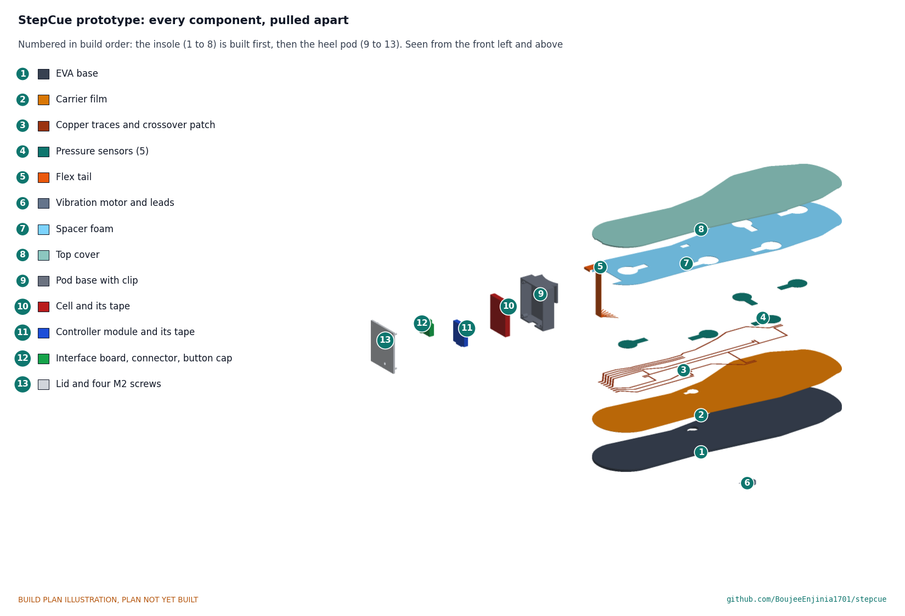

*Figure 1. Every component pulled apart and numbered in build order: the insole (1 to 8), then the heel pod (9 to 13).*

The prototype is one instrumented insole for a right shoe of about EU 42 (US men's 8.5) and a small pod that clips over the shoe's heel counter. The insole is four thin layers bonded together: an EVA foam base, a polyimide carrier film with a hand-laid copper tape circuit, a thin foam spacer, and a foam top cover cut from a bought insole. Five pressure sensors and a coin vibration motor sit in it, and a flat flex tail runs from the heel up the inside of the counter and over its top into the pod. The pod is a printed tray and lid holding a small lithium polymer cell, a bought controller module and a hand-wired interface board with a large pause button. Figure 1 shows the 13 components in the order you make or fit them. Seven are made: the four insole layers are cut with a knife (one also carries the copper circuit), the pod base and lid are 3D printed, and the interface board is built on perfboard. The rest are bought. The work is cutting foam and film, laying copper tape, fine soldering, two 3D prints and some hand wiring. The parts cost about USD 90, from the bill of materials.

> **Safety:** The pod holds a lithium polymer cell. Use a protected cell only, keep it out of the pod until section 6 says otherwise, never charge it while worn or wet, and stop using a cell that is swollen, damaged or warm. Soldering on thin film and foam is a burn and fume risk: use a fume extractor and keep the iron in its stand. Contact adhesive and its fumes are flammable: spray outdoors or in a ventilated space, away from the iron.

## 2. What changed to make it buildable

The concept showed what StepCue does; some of its parts could not be made or joined as drawn. Each change below keeps what StepCue does, and all of them are recorded in decision record STC-DDR-003, open for Amish's review.

*Table 1. Changes from the concept.*

| Component | The concept had | The buildable design has | Why |
| --- | --- | --- | --- |
| Sensor laminate | One solid 0.8 mm sheet with pockets, and no conductors | A polyimide carrier film with copper tape traces (0.3 mm) under a foam spacer with windows (0.5 mm); same 0.8 mm (Figures 3 and 4) | Each layer can be bought and cut; the sensors connect to the tail |
| Sensors | Plain discs | Each with its tail and two tabs soldered to pads (Figure 5) | That is how the sensor is joined |
| Circuit | None drawn | Eight traces, with one insulated crossover (Figures 4 and 9) | Five sensors and the motor need eight conductors on one face |
| Motor | On a 0.2 mm foam floor, in a relief cut in the laminate | In a hole through the base and the carrier, stuck under the spacer (Figure 7) | A through-hole can be punched; a 0.2 mm floor cannot be cut |
| Flex tail | 12 mm wide, laid in the laminate with no joint | 9 mm wide (8 ways), its end slit into strips soldered to pads 4 mm apart (Figure 6) | An 8-way cable is 9 mm wide; 1 mm pitch is too fine to solder by hand |
| Clip | Flat finger against a flat counter | Finger and bridge curved to the counter (Figure 12) | A real heel counter is curved; the flat finger cut into it |
| Inside the pod | Tail ended at the wall; parts held by nothing | A tail connector on top of the interface board, the board above the module, parts taped to the cell (Figure 16) | The tail reaches its connector; nothing rattles |
| Controller module | USB-C up, short of the wall | USB-C down, through a notch in the bottom wall (Figure 13) | The board must sit below the connector; the plug now seats fully |
| Lid | No fixing; tact switch short of the lid | Four M2 screws into corner bosses; a button cap 1 mm proud (Figures 17 and 18) | The lid holds everything; the button can be pressed |
| Pod width | 34 mm | 37 mm | Room for the lid bosses beside the cell |
| Insole outline | Straight runs between the heel and toe curves | One smooth curve with no corners, traces still 1.5 mm inside the edge (Figure 4) | A smooth edge cuts cleanly and sits evenly against the shoe |
| Pod corners | Square | Rounded to 5 mm, with a shallow groove where the lid meets the base (Figures 11 and 17) | Nothing to catch on clothing; the joint reads as a clean line |

## 3. Making the components

Make and check each component before the assembly step that needs it. Sizes are in millimetres. Positions on the insole are measured forward from the back of the heel and sideways from the insole's centre line, plus toward the big toe; the insole is for a right foot (mirror everything for a left foot). Workshop tolerance is 0.5 mm unless a step says otherwise; drawings do not carry tolerances before TRL 4.

### 3.1 EVA base

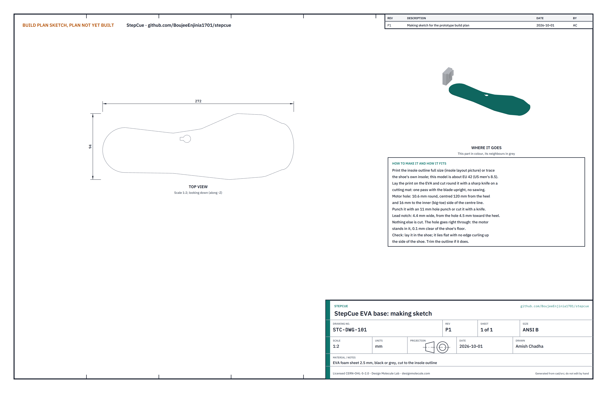

*Figure 2. EVA base making sketch (STC-DWG-101).*

**What it is and what it is made from.** The bottom layer of the insole, which sits on the shoe's floor. Black or grey EVA foam sheet 2.5 mm thick.

**How to make it.**

1. Print the insole outline full size from the insole layout (Figure 4). It is one smooth curve with no corners. If you trace round the shoe's own insole instead, keep every copper trace at least 1.5 mm inside its edge. Check the print against a ruler: 272 mm long.
2. Lay the print on the foam and cut round it with a sharp knife on a cutting mat, blade upright, one steady pass.
3. Punch the motor hole, 10.6 mm (an 11 mm punch is fine), centred 120 forward and 16 toward the big toe.
4. Cut the lead notch: 4.4 mm wide, from the hole 4.5 mm toward the heel.

**How it fits the parts next to it.** The carrier film sticks to its top face with the two motor holes lined up (step 2). Its underside lies on the shoe's floor; nothing is stuck to it.

**Check before moving on.** It lies flat in the shoe with no edge climbing the shoe's side; trim the outline if it does.

### 3.2 Carrier film with the copper circuit

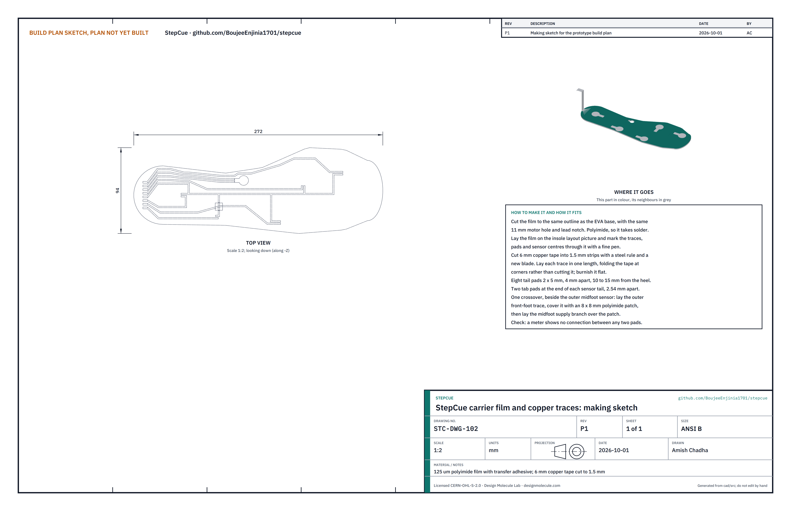

*Figure 3. Carrier film and copper traces making sketch (STC-DWG-102).*

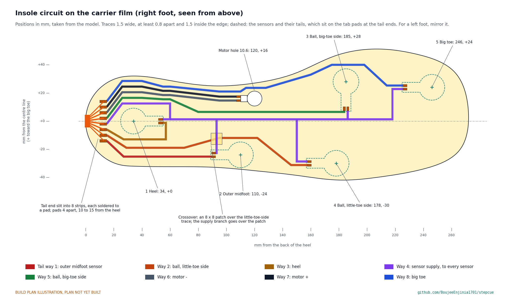

*Figure 4. The circuit on the carrier film, seen from above, with the sensor sites, the motor hole and the eight traces. Print it full size and use it as the template.*

**What it is and what it is made from.** A thin film that carries the copper circuit joining the sensors and the motor to the tail. Polyimide film 125 µm thick with a transfer adhesive on its underside; copper foil tape 6 mm wide with conductive adhesive; one small piece of polyimide tape. Polyimide is used because it does not melt under a soldering iron.

**How to make it.**

1. Cut the film to the same outline as the EVA base, with the same motor hole and lead notch.
2. Lay the film over the printed layout (Figure 4) and mark, with a fine pen, the five sensor centres, the eight tail pads at the heel, the two tab pads at each sensor tail, the two motor lead pads and the line of each trace.
3. Cut the copper tape into strips 1.5 mm wide with a steel rule and a new blade. Cut the pads from the same tape: tail pads 2 x 5, tab pads 1.6 x 3 and motor pads 1.5 x 3.
4. Lay each trace in one piece from its pad at the heel to its pad at the sensor. At a corner, fold the tape over itself rather than cutting it, so the trace stays continuous. Burnish each trace flat with the back of a spoon.
5. The supply trace runs up the centre line with a short branch to every sensor. Where the branch to the outer midfoot sensor crosses the trace to the ball of the foot on the little-toe side, lay that lower trace first, cover it with an 8 x 8 mm square of polyimide tape, then lay the branch over the square (Figure 9).
6. Keep every trace at least 0.8 mm from the next, 1.5 mm inside the edge and off the sensor discs, as Figure 4 shows.

**How it fits the parts next to it.** Its underside sticks to the EVA base. The sensors, the tail end and the motor leads are soldered to its pads (sections 3.3 to 3.5); the spacer sticks over it.

**Check before moving on.** With a meter, each trace reads end to end below 1 ohm, and no two pads are connected to each other, including across the crossover.

### 3.3 Pressure sensors (buy 5)

**What they are.** Five round force-sensing resistors, 18.3 mm across and 0.46 mm thick, each with a short flat tail ending in two solder tabs 2.54 mm apart (BOM line 2).

**What to do to them.** Nothing before fitting. Check that each tail and tab spacing matches the tab pads on the carrier; if your sensors have a longer tail, move the tab pads to suit before laying the traces.

**How they fit the parts next to them.** Each sensor lies face up on the carrier at its site with its tail along its tab pads, held by its own adhesive backing, and each tab is soldered to its pad: one to the supply, one to its own trace.

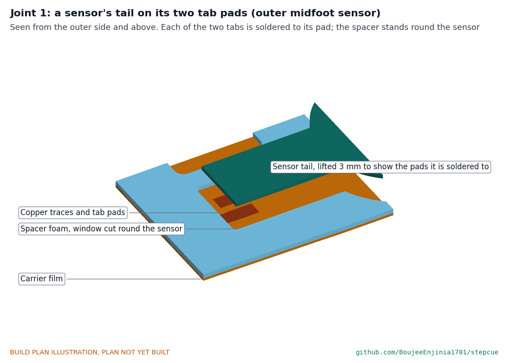

*Figure 5. The tail of the outer midfoot sensor, drawn lifted 3 mm so the two tab pads under it show; the spacer foam has a window round the whole sensor.*

**Check before moving on.** Pressing the sensor with a finger changes its resistance, read at its pad at the heel and the supply pad, from several hundred kilohms or more to a few kilohms.

### 3.4 Flex tail (buy 1)

**What it is.** An 8-way flat flex cable with a 1.0 mm pitch, 9 mm wide and 0.3 mm thick, about 100 mm long, with tinned ends on the same side (BOM line 4).

**What to do to it.** At one end, slit the cable lengthwise between its conductors for the last 10 mm with a new blade against a steel rule, making eight strips. Leave the other end whole for the connector.

**How it fits the parts next to it.** The strips fan out onto the eight tail pads at the heel and each bare end is soldered to its pad. The full-width part runs back over the heel edge, turns up the inside of the heel counter under the clip, crosses the counter's top and enters the pod (section 3.8).

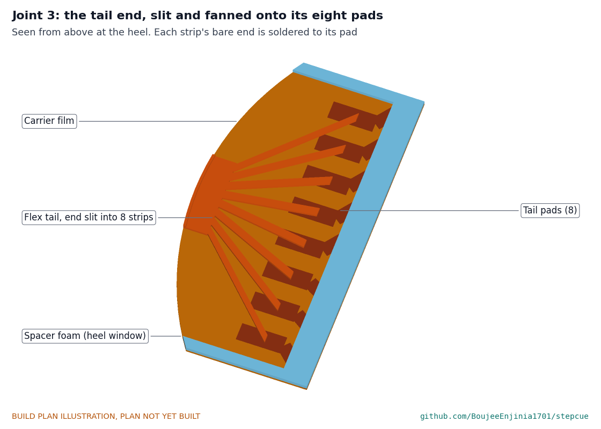

*Figure 6. Each strip of the tail lies on its own pad.*

**Check before moving on.** Each conductor reads below 1 ohm from its pad to the far end of the tail, and no two strips touch.

### 3.5 Vibration motor (buy 1)

**What it is.** A 10 mm coin vibration motor, 2.7 mm thick, 3 V, with an adhesive face and two flying leads (BOM line 5).

**What to do to it.** Shorten the leads to about 8 mm and tin their ends.

**How it fits the parts next to it.** It stands in the motor hole, adhesive face up, with its leads up through the notch onto the two motor pads. Its top face sticks to the underside of the spacer; its bottom stands 0.1 mm clear of the shoe's floor, under 1.7 mm of foam.

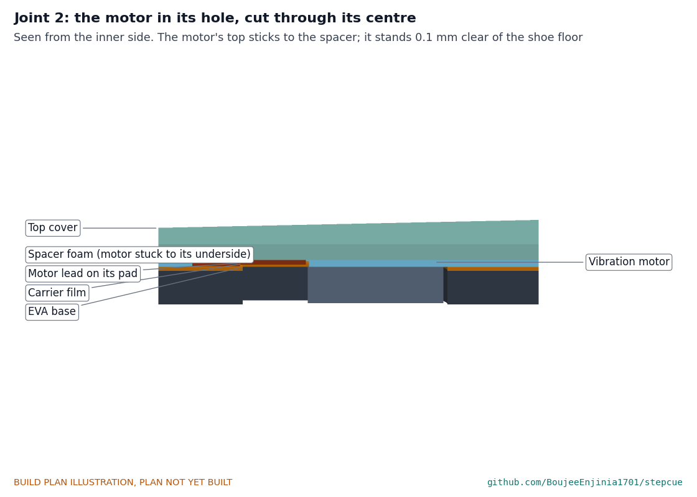

*Figure 7. Cut through the motor's centre: base, carrier, motor, spacer and cover.*

**Check before moving on.** With 3 V from a bench supply through the two motor pads (current limit 100 mA), the motor runs; its top is level with the carrier surface, not above it.

### 3.6 Spacer foam

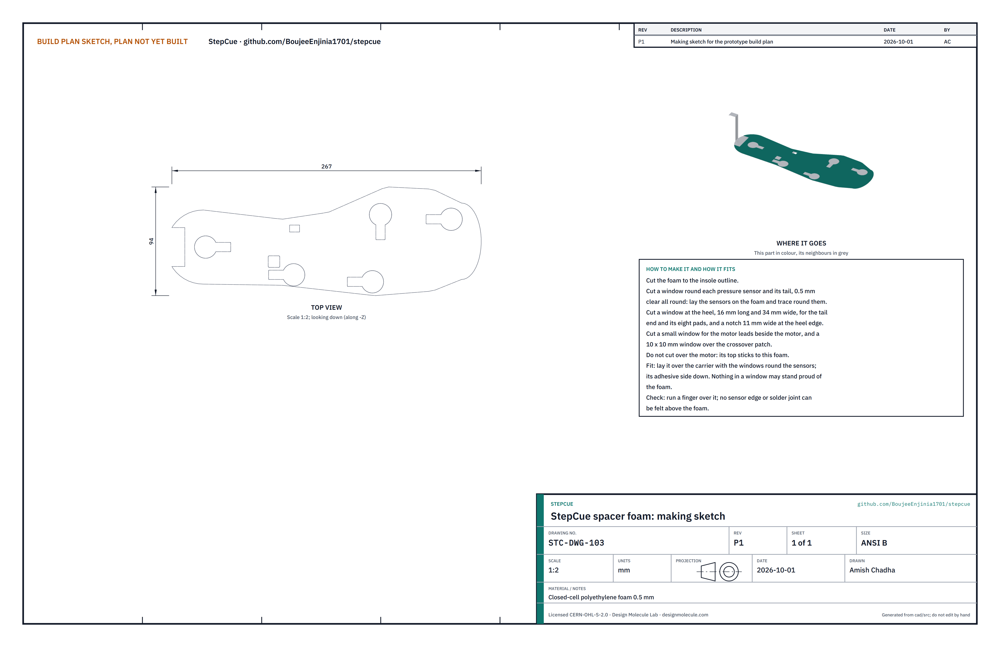

*Figure 8. Spacer foam making sketch (STC-DWG-103).*

**What it is and what it is made from.** The layer that fills the space round the sensors so the cover lies flat. Closed-cell polyethylene foam 0.5 mm thick (BOM line 14), with an adhesive underside or a spray of contact adhesive.

**How to make it.**

1. Cut the foam to the insole outline.
2. Lay the five sensors on it at their sites and trace round each sensor and its tail; cut each window 0.5 mm outside the line.
3. Cut a window at the heel 16 mm long and 34 mm wide for the tail end and its pads, and an 11 mm wide notch at the heel edge.
4. Cut a small window beside the motor for its leads and pads, and a 10 x 10 mm window over the crossover patch. Do not cut over the motor itself.

**How it fits the parts next to it.** It sticks down over the carrier with the windows round the sensors, the tail pads, the leads and the patch, and presses onto the motor's adhesive face.

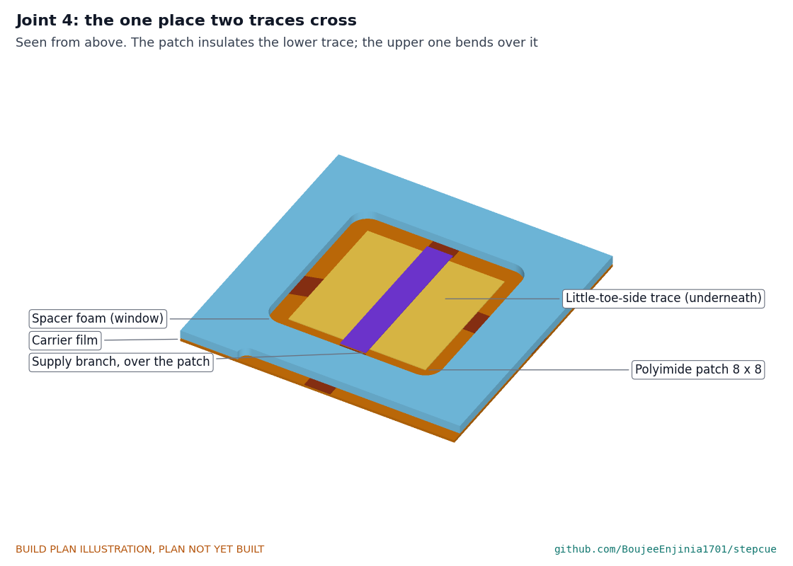

*Figure 9. The one crossover: the lower trace, the polyimide patch over it, the supply branch over the patch, and the spacer window round them.*

**Check before moving on.** Run a finger over the surface: no sensor edge, solder joint or lead can be felt above the foam.

### 3.7 Top cover

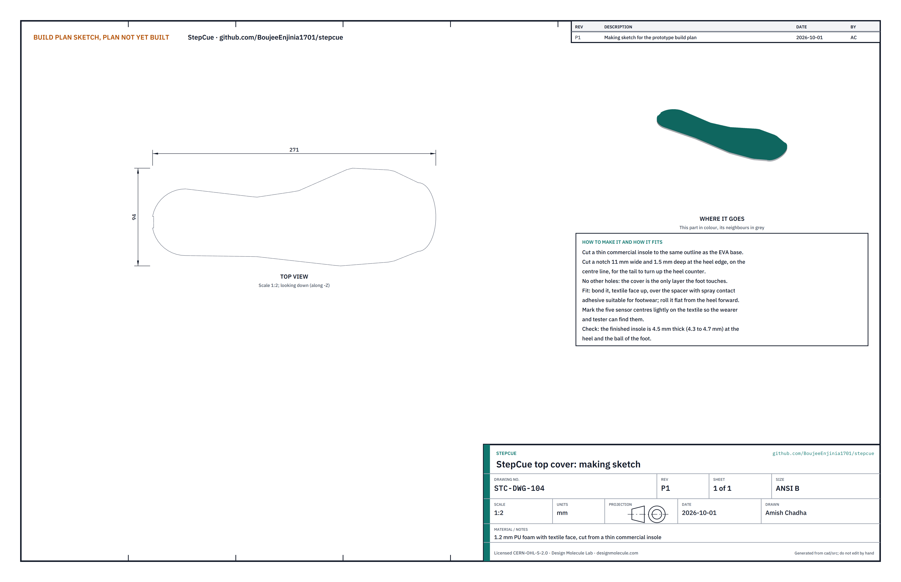

*Figure 10. Top cover making sketch (STC-DWG-104).*

**What it is and what it is made from.** The layer the foot touches. A thin commercial insole of 1.2 mm polyurethane foam with a textile face (BOM line 1).

**How to make it.**

1. Cut the insole to the same outline.
2. Cut an 11 mm wide notch, 1.5 mm deep, at the heel edge on the centre line.
3. Mark the five sensor centres lightly on the textile.

**How it fits the parts next to it.** It is bonded textile face up over the spacer with a contact adhesive made for footwear, rolled on from the heel forward, with the notch over the tail.

**Check before moving on.** The finished insole is 4.5 mm thick (4.3 to 4.7 mm) at the heel and at the ball of the foot, and flat with no bumps over the sensors.

### 3.8 Pod base with clip

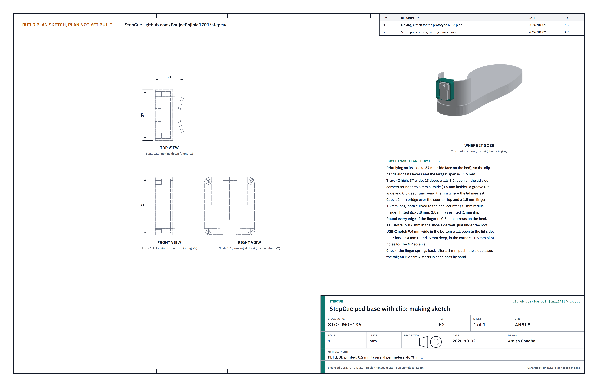

*Figure 11. Pod base making sketch (STC-DWG-105).*

**What it is and what it is made from.** The tray that holds the electronics and the clip that hooks it over the heel counter. PETG, 3D printed.

**How to make it.**

1. Print it lying on one of its 37 mm side faces, at 0.2 mm layers, four perimeters and 40 % infill. In this position the clip bends along its layers, not across them, and the widest span the printer must bridge is 11.5 mm.
2. The tray is 42 high, 37 wide and 13 deep with 1.5 mm walls, open on the lid side. Its four long edges are rounded to 5 mm outside and 3.5 mm inside, so the wall stays 1.5 mm thick round the corners. A groove 0.5 mm wide and 0.5 mm deep runs round the rim where the lid meets it.
3. The clip is a 2 mm bridge over the counter top and a 1.5 mm finger 18 mm long and 26 mm wide, both curved to the counter (32 mm radius inside). As printed, the gap between the finger and the tray is 1 mm narrower than the counter and tail together, so the clip grips.
4. Round every edge of the finger to about 0.5 mm with a fine file: it rests against the wearer's heel through the sock.
5. Clear the tail slot (10 x 0.6 mm, in the shoe-side wall just under the roof), the USB-C notch (9.4 mm wide in the bottom wall) and the four 1.6 mm pilot holes in the corner bosses.

**How it fits the parts next to it.** Its flat shoe-side face rests on the outside of the heel counter at the heel centre; the bridge rides over the counter's top and the tail, and the finger presses the tail against the inside of the counter.

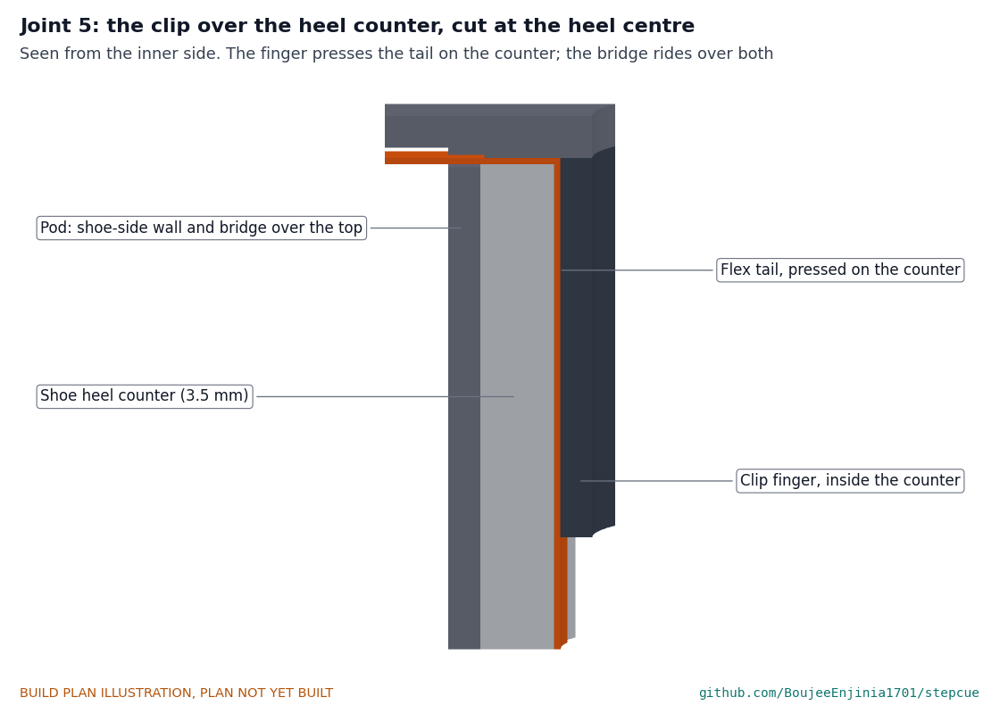

*Figure 12. Cut at the heel centre: the pod's shoe-side wall outside the counter, the bridge over its top, and the finger inside pressing the tail flat on the counter.*

**Check before moving on.** The finger springs back after a 1 mm push; the tail slides through the slot; an M2 screw starts in each boss by hand.

### 3.9 Cell (buy 1)

**What it is.** A 400 mAh, 3.7 V lithium polymer cell about 35 x 25 x 5 mm (502535 class) with built-in protection and a lead (BOM line 8).

**What to do to it.** Check its voltage (3.6 to 4.1 V) and that it is flat and undamaged. Keep it on the charging spot of safety stop S2 until step 9, and unplugged until safety stop S3.

**How it fits the parts next to it.** It stands against the inside of the shoe-side wall, on 0.3 mm double-sided tape down its middle, leads at the bottom.

### 3.10 Controller module (buy 1)

**What it is.** A thumbnail-sized nRF52840 board with a motion sensor, charger and USB-C on board (XIAO nRF52840 Sense class, BOM line 9).

**What to do to it.** Solder a short 2-pin JST-PH lead, to mate with the cell's plug, to its battery pads (the pads on the underside), and insulate the joints with polyimide tape. The cell stays unplugged. Solder the wires to the interface board (section 3.11).

**How it fits the parts next to it.** It sits on the cell's outer face, held by 0.5 mm double-sided foam tape, USB-C downward with the receptacle standing in the notch in the bottom wall.

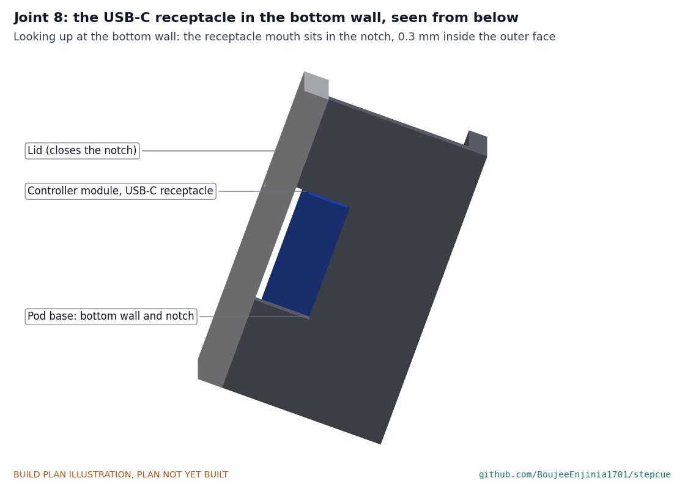

*Figure 13. Looking up at the bottom wall: the receptacle in its notch, closed on the lid side by the lid.*

**Check before moving on.** A USB-C cable plugs in fully and the module's power light comes on (cell disconnected).

### 3.11 Interface board with the tail connector and button cap

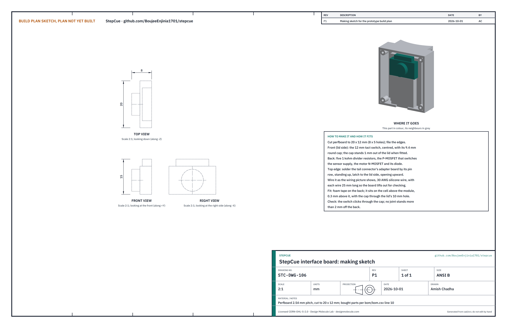

*Figure 14. Interface board making sketch (STC-DWG-106).*

**What it is and what it is made from.** A small hand-wired board that powers the sensors only while it reads them, drives the motor and carries the pause button and the tail connector. Perfboard with 2.54 mm hole spacing; parts per BOM lines 10 and 13.

**How to make it.**

1. Cut the perfboard to 20 x 12 mm (8 x 5 holes) and file the edges.
2. On the front (lid side), fit the 12 mm tact switch in the centre and press its 9.4 mm round cap on.
3. On the back, fit the five 1 kohm resistors, the P-MOSFET that switches the sensor supply, and the motor N-MOSFET with its diode across the motor pins.
4. Solder the tail connector's adapter board to the top edge by its pin row, standing up, opening upward and latch toward the lid.
5. Wire it as Figure 15 shows with 30 AWG silicone wire, each wire about 25 mm long so the board can be lifted out for checking.

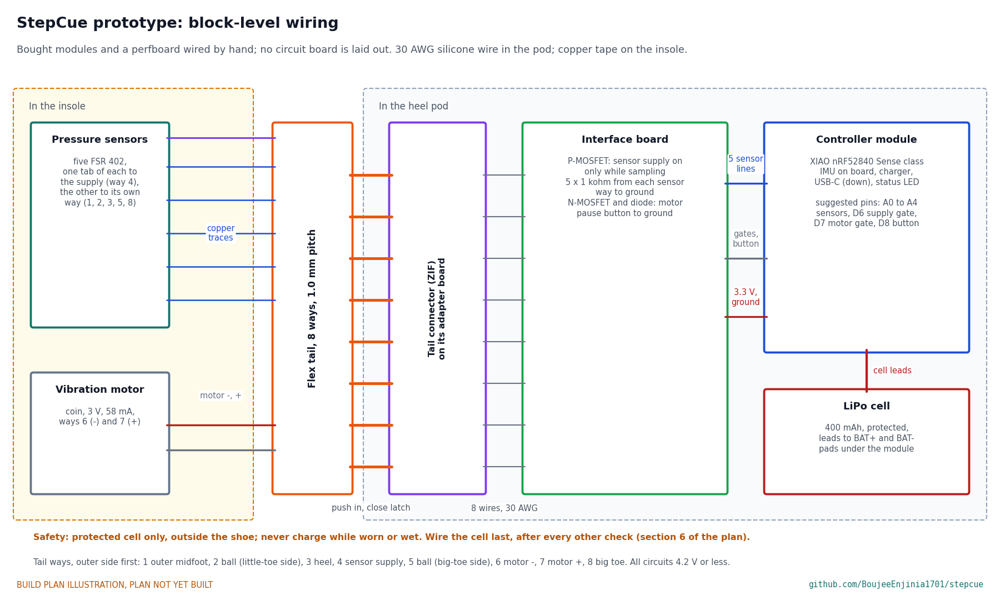

*Figure 15. Block-level wiring. No circuit board is laid out; the controller pins shown are suggestions to be set in the firmware.*

**How it fits the parts next to it.** It sits on the cell's outer face, just above the module, on 0.5 mm foam tape. The tail drops into its connector from above, and the button cap passes through the lid.

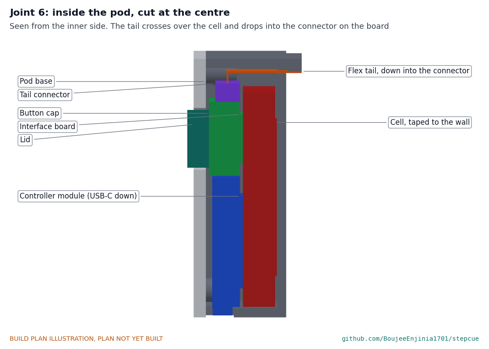

*Figure 16. Cut at the centre: cell against the wall, module below, interface board and connector above, the tail crossing over the cell into the connector.*

**Check before moving on.** The switch clicks through the cap; no joint stands more than 2 mm off the back; with a meter, every one of the eight connector ways reaches the right point on the board.

### 3.12 Lid

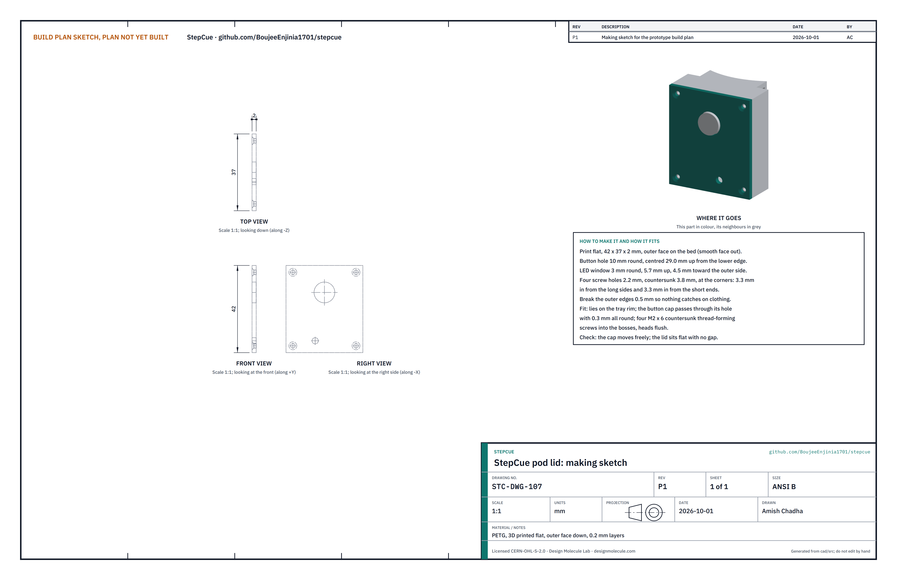

*Figure 17. Lid making sketch (STC-DWG-107).*

**What it is and what it is made from.** The flat cover of the pod. PETG, 3D printed, 42 x 37 x 2 mm, with its corners rounded to 5 mm to match the base.

**How to make it.**

1. Print it flat with its outer face on the bed, so the outside is smooth.
2. Clear the 10 mm button hole, the 3 mm LED window and the four 2.2 mm screw holes; countersink the screw holes to 3.8 mm.
3. Break the outer edges by about 0.5 mm so nothing catches on clothing.

**How it fits the parts next to it.** It lies on the tray's rim and closes the USB-C notch. Four M2 x 6 countersunk thread-forming screws go through it into the corner bosses, heads flush.

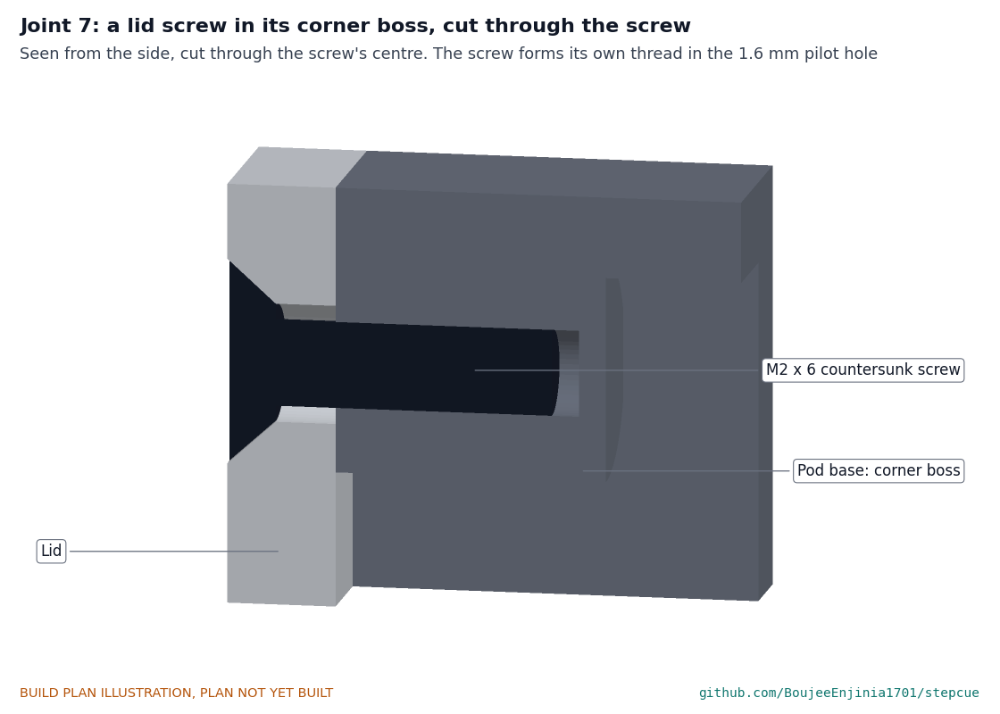

*Figure 18. Cut through the screw: its head sits flush in the lid's countersink and it cuts its own thread in the 1.6 mm pilot hole.*

**Check before moving on.** The lid sits flat on the rim with no gap, and the button cap moves freely in its hole.

### 3.13 Bought components

Buy to specification, not brand. Line numbers are those of the bill of materials.

- **Top cover (line 1).** A thin insole, 1.2 mm polyurethane foam with a textile face.
- **Pressure sensors (line 2).** Five force-sensing resistors, 18.3 mm round, 0.46 mm thick, 0.2 to 20 N, short tail with two solder tabs 2.54 mm apart.
- **Carrier materials (line 3).** Polyimide film 125 µm with transfer adhesive; copper foil tape 6 mm with conductive adhesive; polyimide tape.
- **Flex tail (line 4).** 8-way, 1.0 mm pitch flat flex cable, 9 mm wide, about 100 mm, tinned ends on the same side.
- **Vibration motor (line 5).** 10 mm coin motor, 2.7 mm thick, 3 V, about 60 mA, adhesive face.
- **EVA base (line 6).** EVA foam sheet 2.5 mm.
- **Cell (line 8).** 400 mAh, 3.7 V lithium polymer, about 35 x 25 x 5 mm, with built-in protection.
- **Controller module (line 9).** nRF52840 board with a six-axis motion sensor, six analog inputs, a charger and USB-C, about 21 x 18 mm.
- **Interface board parts (line 10).** Perfboard; five 1 kohm resistors; a logic-level P-MOSFET and N-MOSFET; a small diode; a 12 mm tact switch with a round cap about 9.4 mm across.
- **Hardware (line 12).** Four M2 x 6 countersunk thread-forming screws; 0.3 mm double-sided transfer tape and 0.5 mm double-sided foam tape; polyimide tape; 30 AWG silicone wire; solder; heat-shrink.
- **Tail connector (line 13).** 8-way, 1.0 mm pitch ZIF connector for flat flex cable, on a small adapter board with 2.54 mm pins.
- **Spacer foam (line 14).** Closed-cell polyethylene foam sheet 0.5 mm.

## 4. Putting it together

In each picture the parts already fitted are grey and the part being fitted is in colour, with an arrow showing the way it goes in. The insole layers are shown pulled up from the bench; the pod parts slide into the tray from its open side.

### Step 1: EVA base on the bench

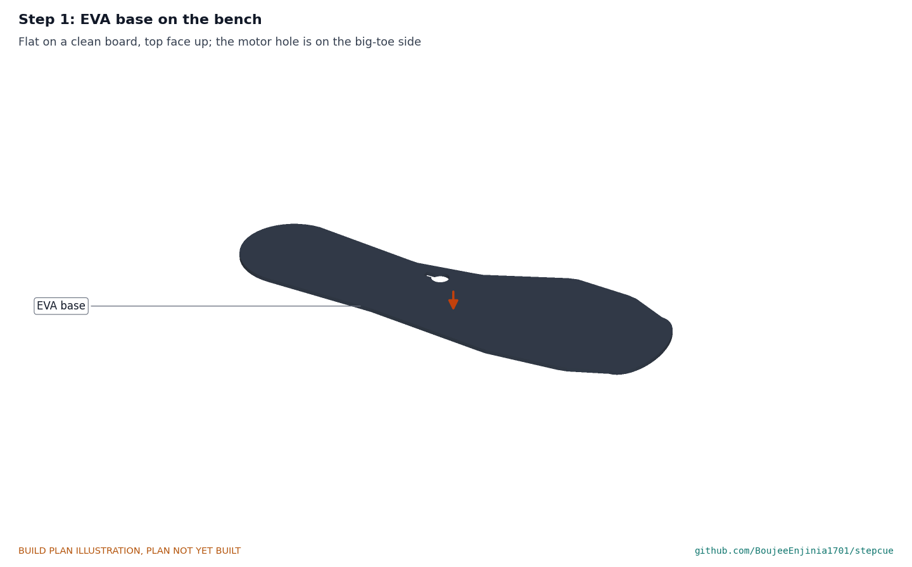

Lay the base flat on a clean board, top face up.

### Step 2: carrier film onto the base

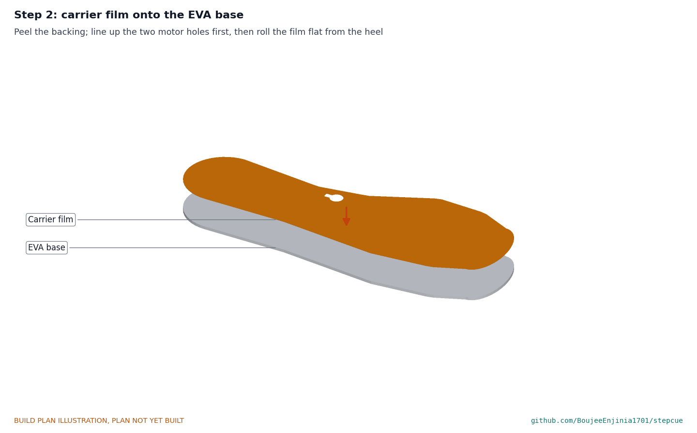

Peel the film's backing. Line up the two motor holes first, then lower the film from the heel forward and roll it flat.

### Step 3: copper traces, pads and the crossover

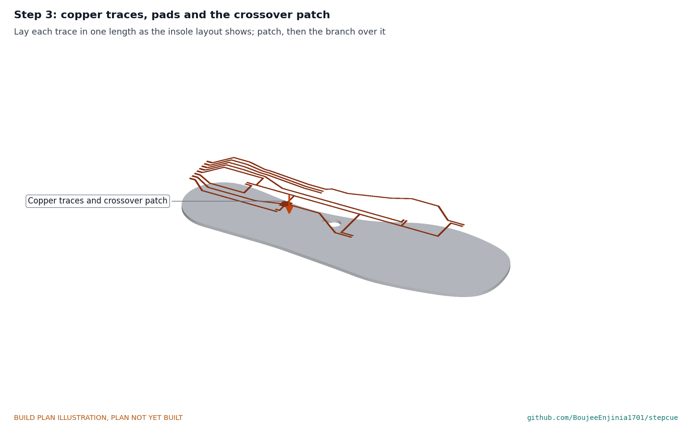

Lay the circuit as section 3.2 describes. **Hold point:** the continuity checks of section 3.2 pass.

### Step 4: pressure sensors

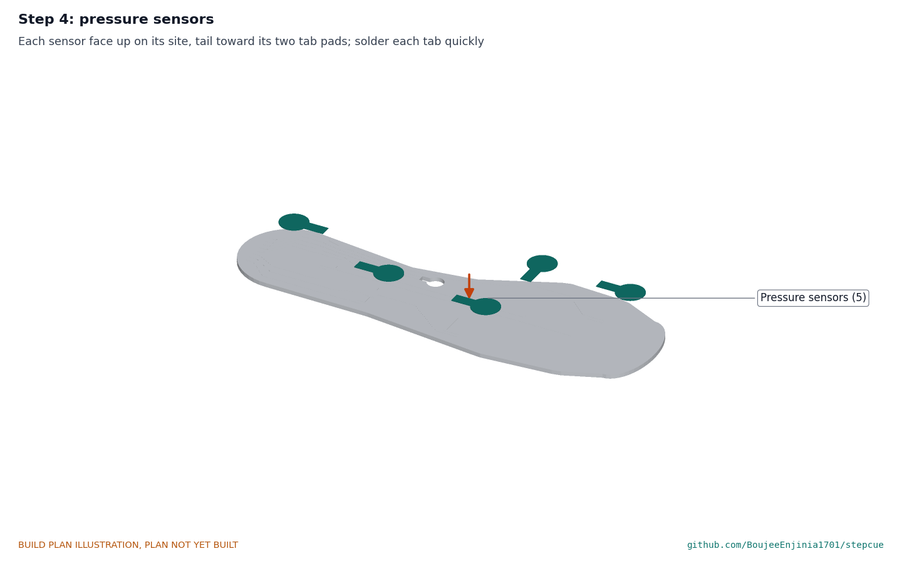

Peel each sensor's backing and place it face up on its site, tail along its tab pads. Solder each tab to its pad quickly with a fine tip at the lowest temperature that wets the joint (about 300 °C), no more than 3 s per tab, so the sensor's film is not damaged.

### Step 5: flex tail end onto its pads

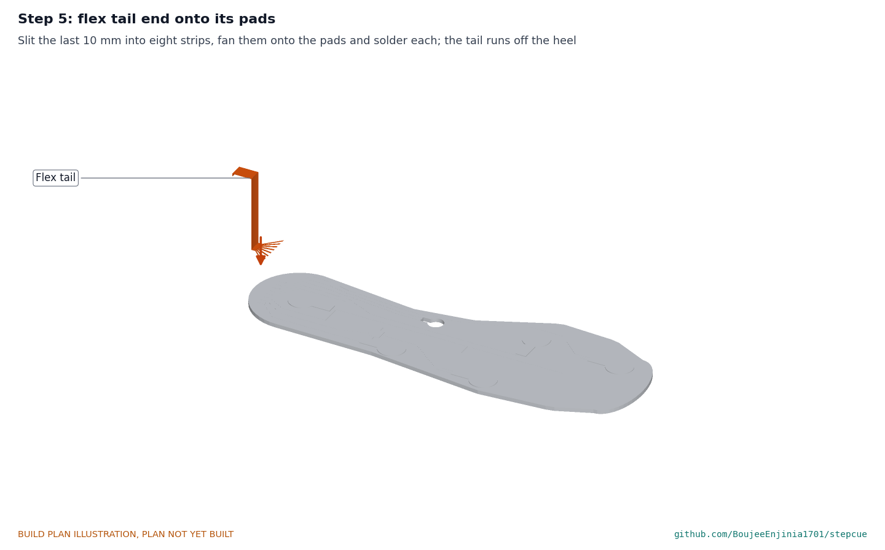

Fan the eight strips onto the eight pads in order (way 1 on the little-toe side) and solder each. The whole tail runs off the back of the heel.

### Step 6: vibration motor into its hole

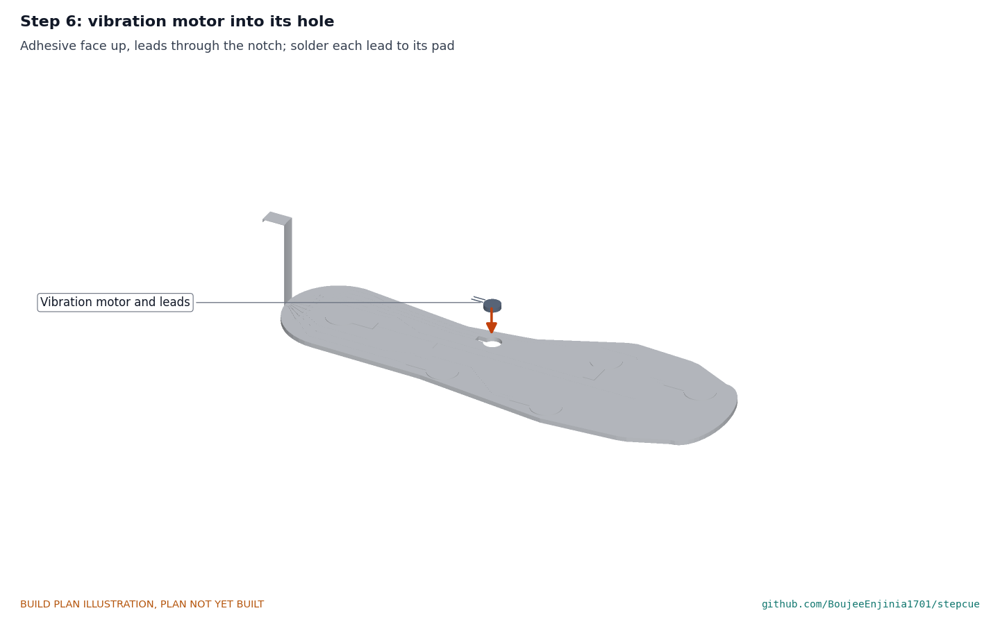

Drop the motor into its hole adhesive face up, leads through the notch, and solder each lead to its pad. Peel the motor's adhesive liner.

### Step 7: spacer foam

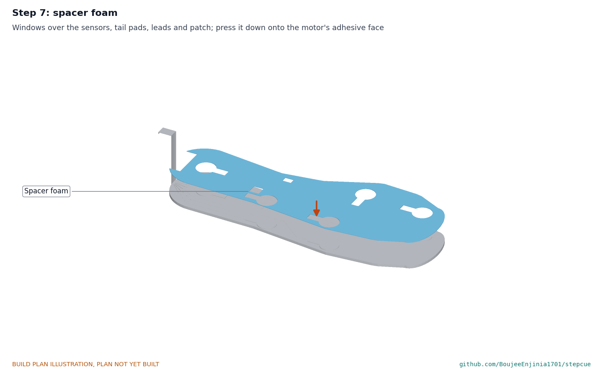

Lay the spacer from the heel forward with its windows round the sensors, the tail pads, the leads and the patch, and press it down over the motor so the motor's top sticks to it. **Hold point:** the sensor and motor checks of sections 3.3 and 3.5 pass again, read from the far end of the tail.

### Step 8: top cover

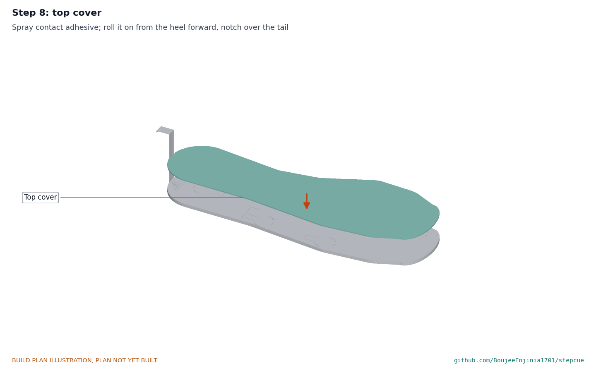

Spray the spacer and the cover with contact adhesive, let it go tacky, and roll the cover on from the heel forward with its notch over the tail.

### Step 9: cell into the pod base

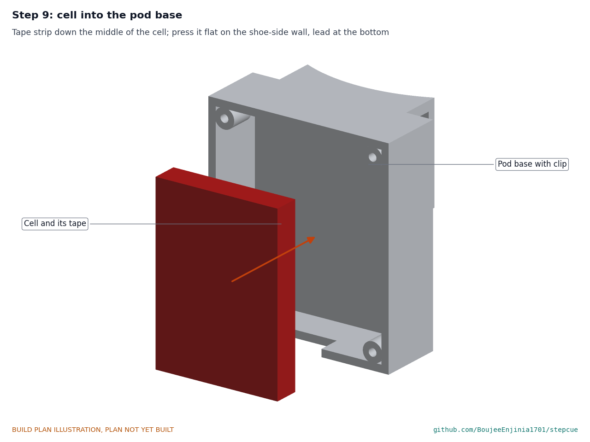

Only after safety stop S2, with the cell unplugged. Tape down the middle of the cell; press it flat on the inside of the shoe-side wall, lead at the bottom.

### Step 10: controller module

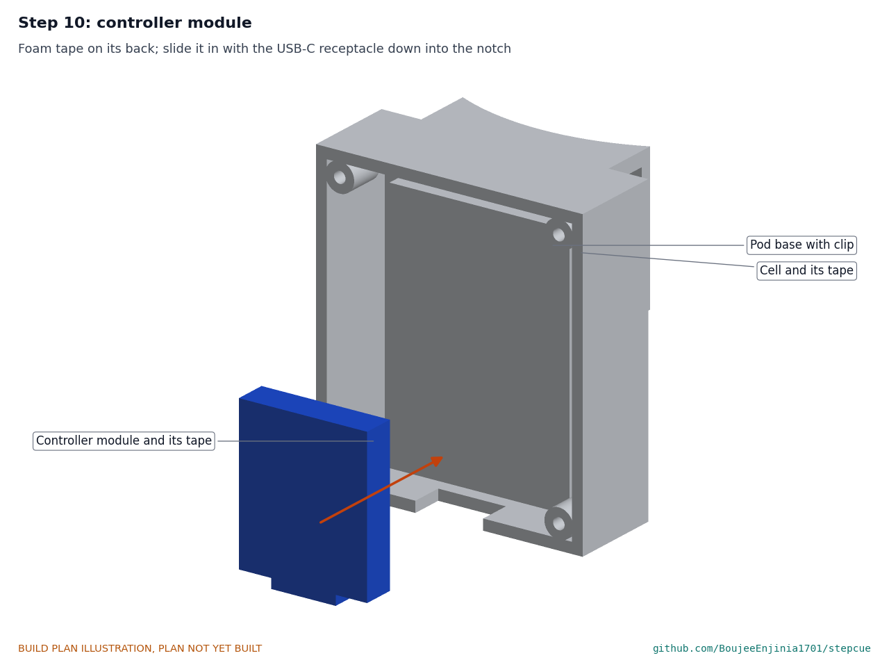

Foam tape on the module's back; slide it in from the open side with the USB-C receptacle down into its notch.

### Step 11: interface board with the connector and button cap

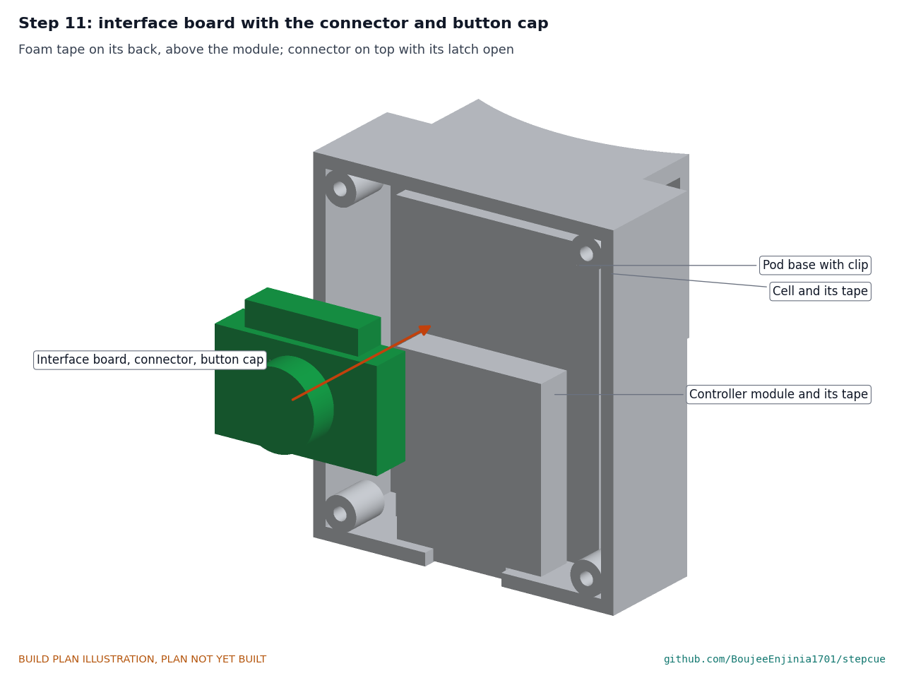

Foam tape on the board's back; place it above the module with the connector on top and its latch open.

### Step 12: tail into the pod and its connector

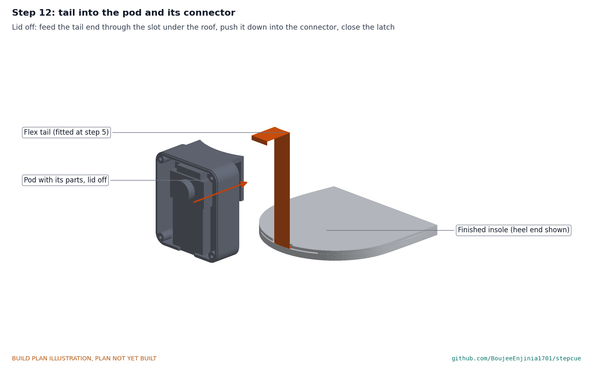

With the lid off, feed the tail's whole end through the slot under the roof from the shoe side, over the cell, and push it down into the connector, contacts toward the board. Close the latch. **Hold point:** the first checks of section 5 for the circuit and the sensors pass.

### Step 13: lid and four screws

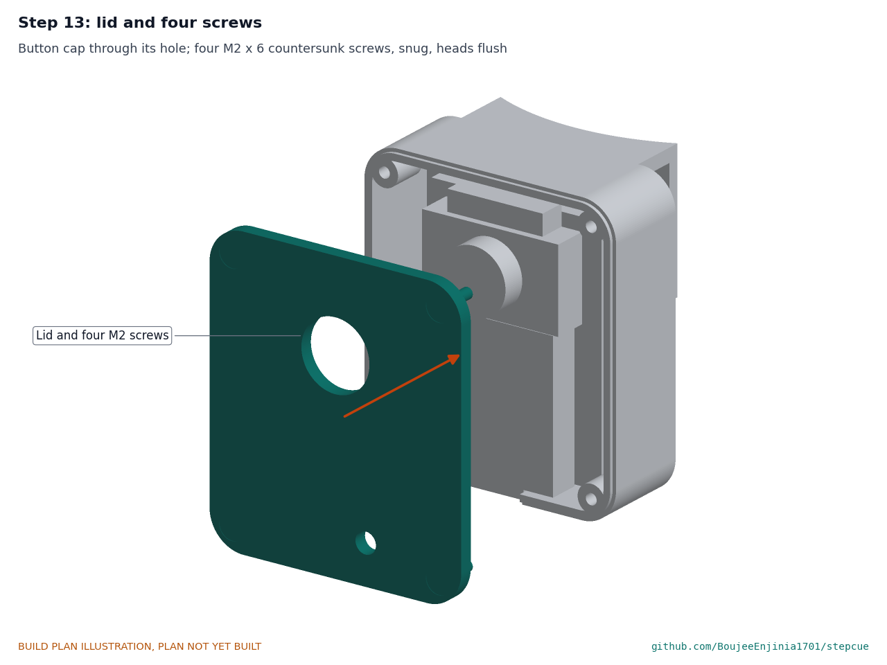

**Hold point:** safety stop S3, then plug the cell in. Lay the lid on with the button cap through its hole. Drive the four M2 x 6 screws until the heads are flush; do not overtighten.

### Step 14: into the shoe and over the heel counter

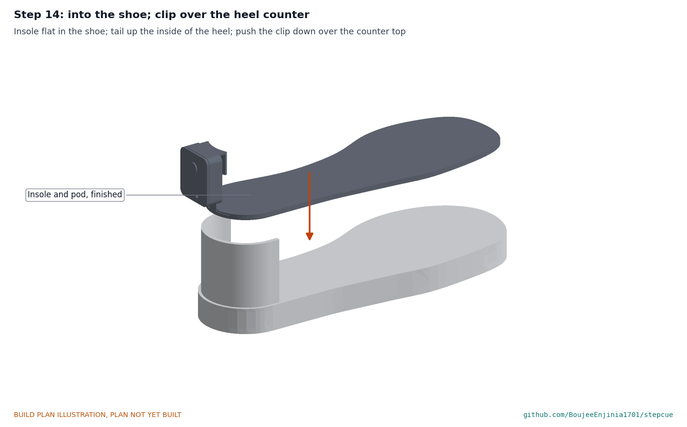

Lay the insole flat in the shoe, the tail running up the inside of the heel. Push the clip down over the counter's top until the bridge rests on it and the finger holds the tail flat against the counter. **Hold point:** safety stop S6.

## 5. First checks

These are the checks a TRL 4 test report would record; this plan only lists them. Requirement numbers are those of STC-REQ-001.

*Table 2. First checks.*

| Check | Requirement | How | Pass when |
| --- | --- | --- | --- |
| Insole thickness | R9 | Calipers at the heel and the ball of the foot | 4.3 to 4.7 mm; no bump above any sensor |
| Sensor response | R1 | With the supply on, press each sensor with a 1 kg mass on a 15 mm disc; read each analog input | Each reads clearly apart from unloaded; none reads from a neighbour's press |
| Sampling | R1, R2 | Log all six channels at rest for 10 s | 104 samples per second on every channel |
| Motor cue | R6, R7 | Trigger a test cue from the controller | Pulses of 100 ms at the set tempo, felt through the cover by hand |
| Pause button | R12 | Press the cap during a test cue | The cue stops |
| Pod mass and size | R10 | Weigh the closed pod; measure it | 35 g or less (26.8 g estimated); within 45 x 40 x 20 mm |
| Clip hold | R12 | Clip on and off one-handed on a shoe; pull straight up with a spring scale | On and off one-handed; it holds at least 2.5 N (about 6 N estimated) |
| Charging | R11, R12 | Charge from USB-C with the pod off the shoe, attended | Charges and stops; the cell stays below 40 °C |
| Current while running | R11 | Meter in the cell lead, detector running | About 1.5 mA (2.4 mA at most) |
| No exposed conductors | R15 | Look and feel along the insole edge and the tail | No copper or solder exposed |

## 6. Safety stops

Stop at each point. Carry on only when everything listed is true.

- **S1. Before soldering on the insole.** Fume extractor running; iron in its stand; contact adhesive and its can away from the bench.
- **S2. Before the cell comes into the workshop.** The cell is a protected type with a datasheet from its maker; its voltage is 3.6 to 4.1 V; it is not swollen, dented or warm. A charging spot is ready on a non-combustible surface (ceramic tile or steel tray).
- **S3. Before the cell is plugged in.** With the cell out, the module's battery pads and the interface board's supply read no short to ground; the polarity at the battery pads has been checked with a meter, not by wire colour; nothing in the pod can press on the cell.
- **S4. First charge.** Attended the whole time, pod off the shoe and lid off, on the charging spot; cell temperature checked every 15 minutes. Stop at once if the cell passes 40 °C or swells.
- **S5. Before the motor is driven from the module.** The diode is across the motor; a test cue starts at the lowest intensity.
- **S6. Before the insole is worn, even briefly.** Only by the builder, standing and seated, never walking with someone who freezes. Every edge of the clip finger is rounded; no copper, solder or sensor edge can be felt through the cover; the pod is closed with all four screws; every one of the eight traces reads continuous with a meter, from its connector way to its pad at the sensor or motor, before each wear, however short; the wearer's heel skin is checked after 10 minutes. StepCue is a research and educational prototype, not a medical device, and must not be relied on to prevent falls; wear trials belong to later, supervised work with ethics review.
- **S7. Never charge while worn or wet.** Take the insole and pod out of the shoe together to charge.

## 7. Tools, skills and workspace

**Tools.** Sharp craft knife with spare blades, steel rule and cutting mat; 11 mm hole punch; fine marker; small roller or spoon for burnishing; temperature-controlled soldering iron with a fine conical tip, thin solder and flux pen; fume extractor; tweezers; flush cutters and wire strippers for 30 AWG; multimeter; bench power supply with an adjustable current limit (0 to 5 V, 0 to 0.5 A); 3D printer that prints PETG with a bed of at least 60 x 60 mm; fine flat file; calipers; small Phillips or hex driver for M2; kitchen scale reading to 0.1 g; spring scale to 10 N.

**Skills.** No certified trade is needed. Careful knife work, fine through-hole and surface soldering on heat-sensitive film, basic 3D printing, safe use of a bench power supply and care with lithium cells. All circuits are extra-low voltage: 4.2 V at most at the cell, 5 V on USB.

**Workspace.** A bench about 1.0 x 0.6 m with good light and a magnifier; a ventilated place for the contact adhesive, away from the soldering; the charging spot of S2.

**Personal protective equipment.** Safety glasses when soldering and cutting; nitrile gloves for the adhesive.

## 8. Where the numbers come from

- Model and constructability checks: `cad/src/model.py` (`python cad/src/model.py --check`); STEP and STL exports in `cad/step/` and `cad/stl/`.
- Pictures: `cad/src/build_plan_media.py`, using `.kit/build_views.py`; written to `docs/05-build-plan/` and `cad/drawings/STC-DWG-101` to `STC-DWG-107`.
- General arrangement: `cad/drawings/STC-DWG-001.pdf`, Rev P4.
- Calculations: `docs/04-calcs/01-sizing.md` (STC-CAL-001 v0.4) and `docs/04-calcs/sizing.py`: insole stack (R9), pod size and mass (R10), clip (R12), power (R11), cost (R14).
- Bill of materials: `bom/bom.csv`.
- Decisions: `docs/decisions/0003-design-for-construction.md` (STC-DDR-003), with STC-DDR-001 and STC-DDR-002, indexed in `docs/06-design-decisions.md` (STC-DEC-001).
- Requirements: `docs/03-requirements.md` (STC-REQ-001 v0.6).
